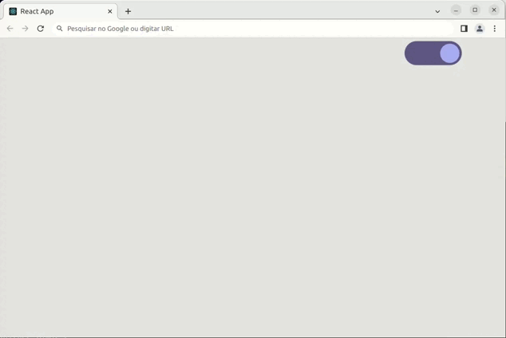

# Dark and light mode demo

A simplified React Switch to toggle light/dark modes.

- Bootstrap and Reactstrap required - install it first with:
### `npm install reactstrap react react-dom`
### `npm install --save bootstrap`

# Demo

# Install the app

### `npm install`

or

### `yarn install`

## Run the app

In the project directory, you can run:

### `npm start`

or

### `yarn start`

Runs the app in the development mode.\
Open [http://localhost:3000](http://localhost:3000) to view it in the browser.

The page will reload if you make edits.\
You will also see any lint errors in the console.
